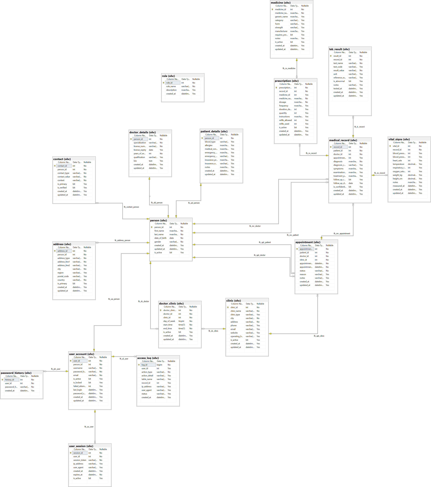

# 🏥 Online Healthcare Appointment & Records System

A comprehensive relational database system for managing healthcare appointments, medical records, prescriptions, and patient data. Built with **Microsoft SQL Server** using advanced database design patterns.

---

## 📋 Table of Contents

- [Overview](#overview)
- [Features](#features)
- [Database Architecture](#database-architecture)
- [Entity Relationship Diagram](#entity-relationship-diagram)
- [Schema Design](#schema-design)
- [Tables Reference](#tables-reference)
- [Views](#views)
- [Stored Procedures](#stored-procedures)
- [Triggers](#triggers)
- [Security Features](#security-features)
- [Sample Queries](#sample-queries)
- [Installation](#installation)
- [Usage Examples](#usage-examples)
- [Best Practices Demonstrated](#best-practices-demonstrated)

---

## Overview

This database system manages a complete healthcare facility operation including:

- **Patient Management** - Demographics, medical history, insurance
- **Doctor Management** - Credentials, specializations, schedules
- **Appointment Scheduling** - Booking, confirmation, status tracking
- **Medical Records** - Diagnoses, treatments, clinical notes
- **Prescriptions** - Medications, dosages, refills
- **Vital Signs & Lab Results** - Clinical measurements
- **User Authentication** - Role-based access control
- **Audit Logging** - Complete activity tracking

---

## Features

### ✅ Core Features

| Feature | Description |
|---------|-------------|
| **Role-Based Design** | Supertype/subtype pattern allowing doctors to also be patients |
| **Normalized Schema** | 3NF design eliminating data redundancy |
| **Referential Integrity** | Comprehensive FK constraints with appropriate cascade rules |
| **Data Validation** | CHECK constraints for business rules |
| **Audit Trail** | Complete logging of all significant actions |
| **Session Management** | Secure user session handling |
| **Password Security** | Hash storage with history to prevent reuse |

### ✅ Advanced Features

| Feature | Description |
|---------|-------------|
| **Overlap Prevention** | Triggers prevent double-booking doctors |
| **Schedule Validation** | Appointments verified against doctor availability |
| **Role Validation** | Ensures only valid patients/doctors in records |
| **Auto-Timestamps** | Automatic `updated_at` maintenance |
| **Filtered Indexes** | Performance optimization for common queries |
| **Computed Views** | Pre-built queries for common data access patterns |

---

## Database Architecture



```
┌─────────────────────────────────────────────────────────────────────────────┐
│                         OnlineHealthCare Database                           │
├─────────────────────────────────────────────────────────────────────────────┤
│  Schema: ohc                                                                │
│                                                                             │
│  ┌─────────────┐  ┌─────────────┐  ┌─────────────┐  ┌─────────────┐        │
│  │   CORE      │  │  CLINICAL   │  │  SCHEDULING │  │  SECURITY   │        │
│  ├─────────────┤  ├─────────────┤  ├─────────────┤  ├─────────────┤        │
│  │ person      │  │ medical_    │  │ appointment │  │ user_account│        │
│  │ role        │  │   record    │  │ doctor_     │  │ user_session│        │
│  │ person_role │  │ prescription│  │   clinic    │  │ access_log  │        │
│  │ contact     │  │ vital_signs │  │ clinic      │  │ password_   │        │
│  │ address     │  │ lab_result  │  │             │  │   history   │        │
│  │ patient_    │  │ medicine    │  │             │  │             │        │
│  │   details   │  │             │  │             │  │             │        │
│  │ doctor_     │  │             │  │             │  │             │        │
│  │   details   │  │             │  │             │  │             │        │
│  └─────────────┘  └─────────────┘  └─────────────┘  └─────────────┘        │
└─────────────────────────────────────────────────────────────────────────────┘
```

---

## Entity Relationship Diagram

> 📊 See `diagrams/physical_er_diagram.png` for the complete Physical ER Diagram

```
                                    ┌─────────────┐
                                    │    role     │
                                    ├─────────────┤
                                    │ role_id (PK)│
                                    │ role_name   │
                                    │ description │
                                    └──────┬──────┘
                                           │
                                           │ 1:N
                                           ▼
┌─────────────┐    1:N    ┌────────────────────────────────┐
│   person    │◄──────────│          person_role           │
├─────────────┤           ├────────────────────────────────┤
│ person_id   │──────────►│ person_id (PK,FK)              │
│ first_name  │           │ role_id (PK,FK)                │
│ last_name   │           │ assigned_at                    │
│ date_of_birth│          │ is_active                      │
│ gender      │           └────────────────────────────────┘
│ is_active   │
└──────┬──────┘
       │
       │ 1:N (for each relationship)
       │
       ├──────────────────┬──────────────────┬──────────────────┐
       ▼                  ▼                  ▼                  ▼
┌─────────────┐    ┌─────────────┐    ┌─────────────┐    ┌─────────────┐
│   contact   │    │   address   │    │  patient_   │    │  doctor_    │
├─────────────┤    ├─────────────┤    │   details   │    │   details   │
│ contact_id  │    │ address_id  │    ├─────────────┤    ├─────────────┤
│ person_id   │    │ person_id   │    │ person_id   │    │ person_id   │
│ contact_type│    │ address_type│    │ blood_type  │    │ specialztn  │
│ contact_val │    │ city        │    │ allergies   │    │ license_num │
│ context     │    │ country     │    │ insurance   │    │ experience  │
└─────────────┘    └─────────────┘    └─────────────┘    └──────┬──────┘
                                                                │
                                                                │ N:M
                                                                ▼
                                      ┌─────────────┐    ┌─────────────┐
                                      │doctor_clinic│───►│   clinic    │
                                      ├─────────────┤    ├─────────────┤
                                      │ doctor_id   │    │ clinic_id   │
                                      │ clinic_id   │    │ clinic_name │
                                      │ day_of_week │    │ city        │
                                      │ start_time  │    │ address     │
                                      │ end_time    │    └─────────────┘
                                      └─────────────┘


┌─────────────────────────────────────────────────────────────────────────────┐
│                           APPOINTMENT & MEDICAL DATA                         │
└─────────────────────────────────────────────────────────────────────────────┘

┌─────────────┐         ┌─────────────┐         ┌─────────────┐
│   person    │         │ appointment │         │   clinic    │
│  (patient)  │◄────────┤             ├────────►│             │
└─────────────┘         ├─────────────┤         └─────────────┘
                        │appointment_id│
┌─────────────┐         │ patient_id  │
│   person    │◄────────│ doctor_id   │
│  (doctor)   │         │ clinic_id   │
└─────────────┘         │ start/end   │
                        │ status      │
                        └──────┬──────┘
                               │
                               │ 1:0..1
                               ▼
                        ┌─────────────┐
                        │  medical_   │
                        │   record    │
                        ├─────────────┤
                        │ record_id   │
                        │ patient_id  │
                        │ doctor_id   │
                        │ diagnosis   │
                        │ treatment   │
                        └──────┬──────┘
                               │
           ┌───────────────────┼───────────────────┐
           │ 1:N               │ 1:N               │ 1:N
           ▼                   ▼                   ▼
    ┌─────────────┐     ┌─────────────┐     ┌─────────────┐
    │prescription │     │ vital_signs │     │ lab_result  │
    ├─────────────┤     ├─────────────┤     ├─────────────┤
    │ medicine_id │     │ bp_sys/dia  │     │ test_name   │
    │ dosage      │     │ heart_rate  │     │ result_val  │
    │ frequency   │     │ temperature │     │ is_abnormal │
    │ duration    │     │ weight/height│    │ reference   │
    └─────────────┘     └─────────────┘     └─────────────┘


┌─────────────────────────────────────────────────────────────────────────────┐
│                              SECURITY & AUDIT                                │
└─────────────────────────────────────────────────────────────────────────────┘

┌─────────────┐    1:1    ┌─────────────┐    1:N    ┌─────────────┐
│   person    │◄──────────│user_account │──────────►│ user_session│
└─────────────┘           ├─────────────┤           └─────────────┘
                          │ user_id     │
                          │ username    │    1:N    ┌─────────────┐
                          │ password_   │──────────►│ access_log  │
                          │   hash      │           └─────────────┘
                          │ is_locked   │
                          └──────┬──────┘    1:N    ┌─────────────┐
                                 │─────────────────►│ password_   │
                                                    │   history   │
                                                    └─────────────┘
```

---

## Schema Design

### Design Patterns Used

| Pattern | Implementation | Benefit |
|---------|---------------|---------|
| **Supertype/Subtype** | `person` → `patient_details` / `doctor_details` | Doctors can also be patients |
| **Junction Table** | `person_role`, `doctor_clinic` | Clean M:N relationships |
| **Lookup Tables** | `role`, `medicine` | Data consistency, prevent typos |
| **Audit Trail** | `access_log`, `password_history` | Security compliance |
| **Soft Delete** | `is_active` flags | Data preservation |

### Normalization

The database is in **Third Normal Form (3NF)**:

1. **1NF** - All columns contain atomic values, no repeating groups
2. **2NF** - All non-key columns depend on the entire primary key
3. **3NF** - No transitive dependencies

---

## Tables Reference

### Core Tables

| Table | Description | Key Columns |
|-------|-------------|-------------|
| `person` | Base entity for all people | `person_id`, `first_name`, `last_name`, `date_of_birth`, `gender` |
| `role` | Lookup table for roles | `role_id`, `role_name` (patient, doctor, admin, nurse, receptionist) |
| `person_role` | Junction: person ↔ role | `person_id`, `role_id`, `is_active` |
| `contact` | Email/phone with context | `contact_id`, `person_id`, `contact_type`, `context` |
| `address` | Multiple addresses per person | `address_id`, `person_id`, `address_type`, `city` |

### Role-Specific Tables

| Table | Description | Key Columns |
|-------|-------------|-------------|
| `patient_details` | Patient-specific data | `person_id`, `blood_type`, `allergies`, `insurance_number` |
| `doctor_details` | Doctor credentials | `person_id`, `specialization`, `license_number`, `years_of_experience` |

### Scheduling Tables

| Table | Description | Key Columns |
|-------|-------------|-------------|
| `clinic` | Healthcare facilities | `clinic_id`, `clinic_name`, `city`, `address` |
| `doctor_clinic` | Doctor schedules at clinics | `doctor_id`, `clinic_id`, `day_of_week`, `start_time`, `end_time` |
| `appointment` | Patient appointments | `appointment_id`, `patient_id`, `doctor_id`, `clinic_id`, `status` |

### Clinical Tables

| Table | Description | Key Columns |
|-------|-------------|-------------|
| `medical_record` | Diagnoses and treatment | `record_id`, `patient_id`, `doctor_id`, `diagnosis`, `treatment_plan` |
| `medicine` | Drug catalog | `medicine_id`, `medicine_name`, `generic_name`, `form`, `strength` |
| `prescription` | Prescribed medications | `prescription_id`, `record_id`, `medicine_id`, `dosage`, `frequency` |
| `vital_signs` | Clinical measurements | `vital_id`, `record_id`, `blood_pressure`, `heart_rate`, `temperature` |
| `lab_result` | Laboratory tests | `result_id`, `record_id`, `test_name`, `result_value`, `is_abnormal` |

### Security Tables

| Table | Description | Key Columns |
|-------|-------------|-------------|
| `user_account` | Login credentials | `user_id`, `person_id`, `username`, `password_hash`, `is_locked` |
| `user_session` | Active sessions | `session_id`, `user_id`, `session_token`, `expires_at` |
| `access_log` | Audit trail | `log_id`, `user_id`, `action_type`, `table_name`, `ip_address` |
| `password_history` | Previous passwords | `history_id`, `user_id`, `password_hash` |

---

## Views

| View | Purpose | Key Data |
|------|---------|----------|
| `v_patient_full` | Complete patient information | Demographics, contacts, insurance, allergies |
| `v_doctor_full` | Complete doctor information | Credentials, specialization, clinics |
| `v_doctor_schedule` | Doctor availability | Day, time, clinic for each doctor |
| `v_appointment_details` | Appointment with names | Patient/doctor names, clinic, status |
| `v_patient_medical_history` | Patient records summary | Diagnoses, doctors, prescription counts |
| `v_prescription_details` | Prescription information | Medicine, dosage, refills remaining |
| `v_patient_vitals` | Vital signs history | BP, heart rate, BMI calculation |
| `v_user_info` | User accounts (no passwords) | Username, roles, login status |
| `v_active_sessions` | Current active sessions | User, IP, session duration |

### Example View Usage

```sql
-- Get all patients with their information
SELECT * FROM ohc.v_patient_full;

-- Get doctor schedules
SELECT * FROM ohc.v_doctor_schedule 
WHERE doctor_name = 'Robert Williams'
ORDER BY day_of_week;

-- Get appointments for today
SELECT * FROM ohc.v_appointment_details
WHERE CAST(appointment_start AS DATE) = CAST(GETDATE() AS DATE);
```

---

## Stored Procedures

### Authentication & Security

| Procedure | Purpose | Parameters |
|-----------|---------|------------|
| `sp_log_action` | Record user activity | `@user_id`, `@action_type`, `@table_name`, `@ip_address` |
| `sp_record_failed_login` | Track failed logins, lock account | `@username`, `@ip_address` |
| `sp_record_successful_login` | Reset attempts, create session | `@user_id`, `@session_token`, `@session_hours` |
| `sp_logout` | Invalidate session | `@session_token` |
| `sp_change_password` | Update with history check | `@user_id`, `@new_password_hash` |
| `sp_check_permission` | Verify user role | `@user_id`, `@required_role`, `@has_permission OUTPUT` |

### Clinical Operations

| Procedure | Purpose | Parameters |
|-----------|---------|------------|
| `sp_create_medical_record` | Create record + update appointment | `@patient_id`, `@doctor_id`, `@diagnosis`, `@record_id OUTPUT` |
| `sp_add_prescription` | Add prescription to record | `@record_id`, `@medicine_name`, `@dosage`, `@prescription_id OUTPUT` |
| `sp_record_vitals` | Record vital signs | `@record_id`, `@bp_systolic`, `@heart_rate`, etc. |
| `sp_get_patient_history` | Get full patient history | `@patient_id` |

### Maintenance

| Procedure | Purpose | Parameters |
|-----------|---------|------------|
| `sp_cleanup_expired_sessions` | Deactivate expired sessions | None |
| `sp_cleanup_old_logs` | Archive old audit logs | `@days_to_keep` |

### Example Procedure Usage

```sql
-- Create a medical record
DECLARE @record_id INT;
EXEC ohc.sp_create_medical_record
    @patient_id = 13,
    @doctor_id = 1,
    @appointment_id = 1,
    @diagnosis = N'Hypertension, controlled',
    @diagnosis_code = 'I10',
    @symptoms = N'Mild headache',
    @treatment_plan = N'Continue current medication',
    @record_id = @record_id OUTPUT;

SELECT @record_id AS NewRecordId;

-- Add prescription
DECLARE @rx_id INT;
EXEC ohc.sp_add_prescription
    @record_id = @record_id,
    @medicine_name = N'Lisinopril 10mg',
    @dosage = N'1 tablet',
    @frequency = N'Once daily',
    @duration_days = 90,
    @quantity = 90,
    @prescription_id = @rx_id OUTPUT;

-- Check user permission
DECLARE @has_perm BIT;
EXEC ohc.sp_check_permission 
    @user_id = 1, 
    @required_role = 'doctor', 
    @has_permission = @has_perm OUTPUT;
SELECT @has_perm AS HasDoctorRole;
```

---

## Triggers

| Trigger | Table | Event | Purpose |
|---------|-------|-------|---------|
| `trg_prevent_doctor_overlap` | `appointment` | INSERT, UPDATE | Prevent double-booking |
| `trg_validate_doctor_clinic` | `appointment` | INSERT, UPDATE | Ensure doctor works at clinic on that day/time |
| `trg_validate_appointment_roles` | `appointment` | INSERT, UPDATE | Verify patient/doctor roles |
| `trg_validate_medical_record_roles` | `medical_record` | INSERT, UPDATE | Verify patient/doctor roles |
| `trg_person_updated_at` | `person` | UPDATE | Auto-update timestamp |
| `trg_appointment_updated_at` | `appointment` | UPDATE | Auto-update timestamp |
| `trg_medical_record_updated_at` | `medical_record` | UPDATE | Auto-update timestamp |
| `trg_log_appointment_changes` | `appointment` | INSERT, UPDATE, DELETE | Audit trail |

### Trigger Behavior Examples

```sql
-- This will FAIL - doctor overlap
INSERT INTO ohc.appointment (patient_id, doctor_id, clinic_id, appointment_start, appointment_end, status)
VALUES (14, 1, 1, '2025-02-17 09:15:00', '2025-02-17 09:45:00', 'scheduled');
-- Error: "Doctor already has an appointment during this time slot."

-- This will FAIL - doctor doesn't work at clinic on Sunday
INSERT INTO ohc.appointment (patient_id, doctor_id, clinic_id, appointment_start, appointment_end, status)
VALUES (14, 1, 1, '2025-02-16 10:00:00', '2025-02-16 10:30:00', 'scheduled');
-- Error: "Doctor does not work at this clinic on this day/time."

-- This will FAIL - person is not a patient
INSERT INTO ohc.appointment (patient_id, doctor_id, clinic_id, appointment_start, appointment_end, status)
VALUES (7, 1, 1, '2025-02-17 11:00:00', '2025-02-17 11:30:00', 'scheduled');
-- Error: "Invalid patient: person does not have patient role."
```

---

## Security Features

### Password Security

```sql
-- Passwords stored as hashes (never plain text)
-- Password history prevents reuse of last 5 passwords
-- Account locks after 5 failed login attempts

-- Check if account is locked
SELECT username, is_locked, failed_attempts 
FROM ohc.user_account 
WHERE is_locked = 1;

-- Unlock account (admin operation)
UPDATE ohc.user_account 
SET is_locked = 0, failed_attempts = 0 
WHERE username = 'locked_user';
```

### Session Management

```sql
-- Sessions expire after configurable time (default 24 hours)
-- Each session has unique token
-- Sessions track IP and user agent

-- View active sessions
SELECT * FROM ohc.v_active_sessions;

-- Force logout all sessions for user
UPDATE ohc.user_session 
SET is_active = 0 
WHERE user_id = 1;
```

### Audit Logging

```sql
-- All significant actions are logged
SELECT 
    al.created_at,
    ua.username,
    al.action_type,
    al.action_detail,
    al.table_name,
    al.ip_address,
    al.status
FROM ohc.access_log al
LEFT JOIN ohc.user_account ua ON al.user_id = ua.user_id
ORDER BY al.created_at DESC;
```
---

## Installation

### Prerequisites

- Microsoft SQL Server 2017 or later
- SQL Server Management Studio (SSMS) or Azure Data Studio
- Minimum 100MB disk space

### Installation Steps

1. **Create Database and Tables**
   ```sql
   -- Run the schema creation script
   -- File: 01_ddl_tables_and_indecies.sql
   ```

2. **Create Views**
   ```sql
   -- Run the views script
   -- File: 02_ddl_views.sql
   ```

3. **Create Triggers**
   ```sql
   -- Run the triggers script
   -- File: 03_ddl_trigers.sql
   ```

4. **Create Stored Procedures**
   ```sql
   -- Run the stored procedures script
   -- File: 04_ddl_stored_procedures.sql
   ```

5. **Insert Sample Data**
   ```sql
   -- Run the data insertion script
   -- File: 05_dml_insert_data.sql
   ```

6. **Verify Installation**
   ```sql
   -- Check table counts
   SELECT 'Persons' AS entity, COUNT(*) AS count FROM ohc.person
   UNION ALL SELECT 'Appointments', COUNT(*) FROM ohc.appointment
   UNION ALL SELECT 'Medical Records', COUNT(*) FROM ohc.medical_record;
   ```

7. **Run Analytics (Optional)**
   ```sql
   -- Run reporting queries as needed
   -- File: 06_dql_analytics.sql
   ```

### Database Configuration

```sql
-- The database uses Ukrainian collation for proper character support
CREATE DATABASE OnlineHealthCare
COLLATE Ukrainian_CI_AS;

-- Ensure Monday = 1 for day_of_week consistency
SET DATEFIRST 1;
```

---

## Usage Examples

### Creating a New Patient

```sql
-- 1. Create person record
INSERT INTO ohc.person (first_name, last_name, date_of_birth, gender)
VALUES (N'John', N'Smith', '1990-05-15', 'Male');

DECLARE @person_id INT = SCOPE_IDENTITY();

-- 2. Assign patient role
INSERT INTO ohc.person_role (person_id, role_id)
VALUES (@person_id, (SELECT role_id FROM ohc.role WHERE role_name = 'patient'));

-- 3. Add patient details
INSERT INTO ohc.patient_details (person_id, blood_type, allergies, insurance_number)
VALUES (@person_id, 'O+', N'Penicillin', 'INS-2025-0001');

-- 4. Add contact information
INSERT INTO ohc.contact (person_id, contact_type, contact_value, context, is_primary)
VALUES 
    (@person_id, 'email', 'john.smith@email.com', 'personal', 1),
    (@person_id, 'phone', '+1-555-1234', 'personal', 1);

-- 5. Add address
INSERT INTO ohc.address (person_id, address_type, address_line1, city, region, postal_code, is_primary)
VALUES (@person_id, 'home', N'123 Main Street', N'Springfield', N'Illinois', '62701', 1);

-- 6. Create user account
INSERT INTO ohc.user_account (person_id, username, password_hash, email)
VALUES (@person_id, 'john.smith', 'HASHED_PASSWORD_HERE', 'john.smith@email.com');
```

### Booking an Appointment

```sql
-- Check doctor availability
SELECT * FROM ohc.v_doctor_schedule
WHERE doctor_id = 1 AND day_of_week = DATEPART(WEEKDAY, '2025-02-17');

-- Book appointment
INSERT INTO ohc.appointment (patient_id, doctor_id, clinic_id, appointment_start, appointment_end, status, reason)
VALUES (13, 1, 1, '2025-02-17 14:00:00', '2025-02-17 14:30:00', 'scheduled', N'Annual checkup');
```

### Recording a Visit

```sql
-- Create medical record
DECLARE @record_id INT;
EXEC ohc.sp_create_medical_record
    @patient_id = 13,
    @doctor_id = 1,
    @appointment_id = 1,
    @diagnosis = N'Essential hypertension',
    @diagnosis_code = 'I10',
    @symptoms = N'Headache, dizziness',
    @treatment_plan = N'Lifestyle modifications, medication',
    @follow_up_required = 1,
    @follow_up_date = '2025-05-17',
    @record_id = @record_id OUTPUT;

-- Record vital signs
EXEC ohc.sp_record_vitals
    @record_id = @record_id,
    @bp_systolic = 145,
    @bp_diastolic = 92,
    @heart_rate = 78,
    @temperature = 36.8,
    @weight_kg = 82.5,
    @height_cm = 175.0;

-- Add prescription
DECLARE @rx_id INT;
EXEC ohc.sp_add_prescription
    @record_id = @record_id,
    @medicine_name = N'Lisinopril 10mg',
    @dosage = N'1 tablet',
    @frequency = N'Once daily in the morning',
    @duration_days = 30,
    @quantity = 30,
    @instructions = N'Take with or without food',
    @refills_allowed = 3,
    @prescription_id = @rx_id OUTPUT;
```

---

## Best Practices Demonstrated

### Database Design

| Practice | Implementation |
|----------|---------------|
| **Normalization** | 3NF design, no redundant data |
| **Naming Conventions** | Consistent `snake_case`, clear prefixes (`pk_`, `fk_`, `ck_`, `ix_`) |
| **Data Types** | Appropriate types (NVARCHAR for Unicode, DATETIME2 for precision) |
| **Constraints** | Comprehensive PK, FK, UNIQUE, CHECK constraints |
| **Indexes** | Strategic indexes on frequently queried columns |
| **Documentation** | Comments explaining design decisions |

### Security

| Practice | Implementation |
|----------|---------------|
| **Password Hashing** | Never store plain text passwords |
| **Password History** | Prevent reuse of recent passwords |
| **Account Lockout** | Lock after failed attempts |
| **Session Management** | Token-based with expiration |
| **Audit Logging** | Complete activity trail |
| **Role-Based Access** | Granular permission checking |

### Performance

| Practice | Implementation |
|----------|---------------|
| **Filtered Indexes** | Index only active records |
| **Covering Indexes** | Include commonly accessed columns |
| **Views** | Pre-built complex queries |
| **Stored Procedures** | Compiled execution plans |

---

## File Structure

```
healthcare_db/
│
├── 01_ddl_tables_and_indecies.sql   # Database schema: tables, constraints, indexes
├── 02_ddl_views.sql                  # All database views
├── 03_ddl_trigers.sql                # Validation and audit triggers
├── 04_ddl_stored_procedures.sql      # Business logic procedures
├── 05_dml_insert_data.sql            # Sample data insertion
├── 06_dql_analytics.sql              # Reporting and analytics queries
├── README.md                         # This documentation
│
└── diagrams/
    └── physical_er_diagram.png       # Physical Entity Relationship Diagram
```

### Script Execution Order

Run scripts in numerical order for proper dependency resolution:

| Order | File | Type | Description |
|-------|------|------|-------------|
| 1 | `01_ddl_tables_and_indecies.sql` | DDL | Creates database, schema, tables, constraints, indexes |
| 2 | `02_ddl_views.sql` | DDL | Creates all 9 database views |
| 3 | `03_ddl_trigers.sql` | DDL | Creates validation and audit triggers |
| 4 | `04_ddl_stored_procedures.sql` | DDL | Creates all stored procedures |
| 5 | `05_dml_insert_data.sql` | DML | Inserts sample data (25 persons, appointments, records, etc.) |
| 6 | `06_dql_analytics.sql` | DQL | Analytics queries (run as needed for reporting) |

> **Note:** DDL = Data Definition Language, DML = Data Manipulation Language, DQL = Data Query Language

---

## Contributing

When modifying this database:

1. Follow existing naming conventions
2. Add appropriate constraints for new columns
3. Update views if schema changes
4. Add triggers for audit-sensitive tables
5. Update this README

---

## License

This project is for educational purposes demonstrating database design best practices.

---

## Author

Created as a comprehensive SQL Server database design practice project covering:
- Data modeling
- Normalization
- Constraints
- Indexing
- Transactions
- Views
- Stored Procedures
- Triggers
- Security
- Analytics

---

*Last Updated: February 2025*
